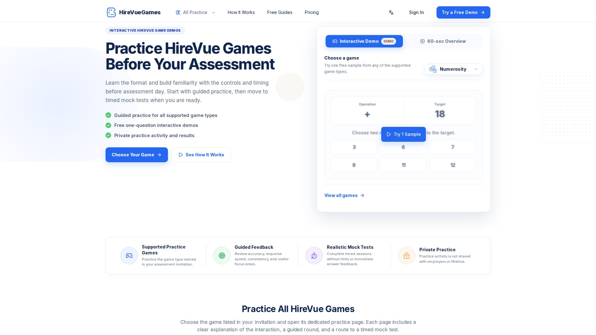
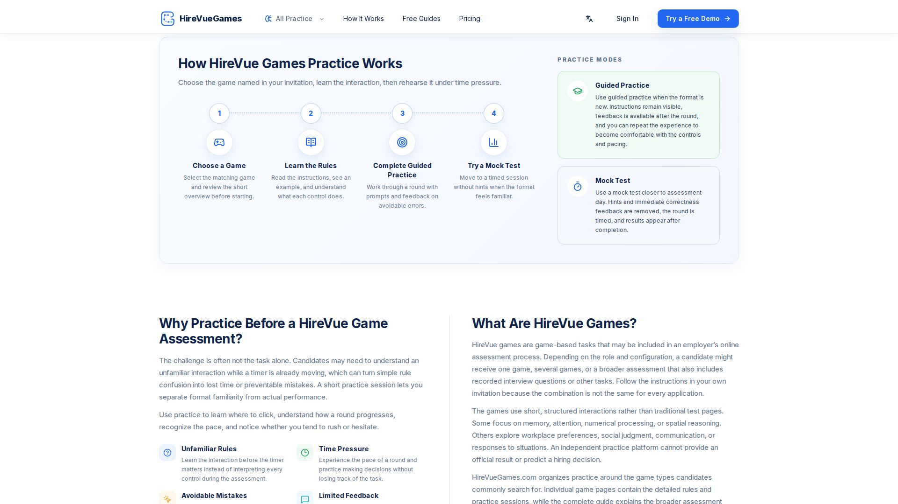
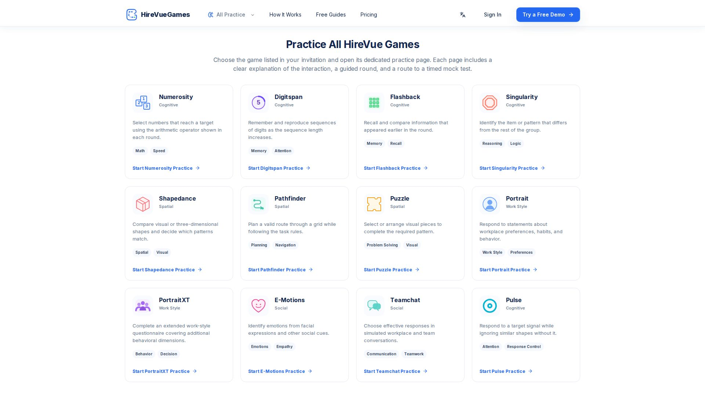
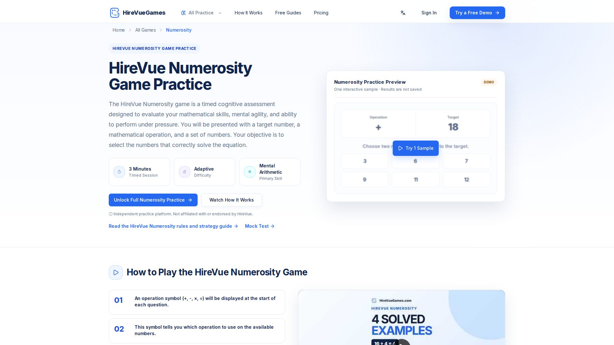

# Practice HireVue Games Before Your Assessment

Preparing for a game-based hiring assessment is easier when the rules, controls, pacing, and response format are no longer unfamiliar. [HireVueGames](https://hirevuegames.com/) is an independent practice platform built to help candidates learn common HireVue game formats through free interactive samples, guided practice, timed mock tests, and private performance feedback.

**Start practicing:** [https://hirevuegames.com/](https://hirevuegames.com/)

## What Are HireVue Games?

HireVue games are short, structured tasks that an employer may include in an online hiring assessment. Depending on the role and assessment configuration, a candidate may receive one game, several games, or a broader assessment containing additional interview or screening activities.

The tasks can focus on different areas, including:

- numerical processing and mental arithmetic;
- memory, attention, and response control;
- visual, spatial, and pattern reasoning;
- planning and problem solving;
- workplace preferences and behavioral choices;
- communication, social judgment, and emotion recognition.

The exact assessment is not the same for every candidate. Always use the invitation and instructions supplied by the employer as the source of truth.

## Why Practice HireVue Games Before the Assessment?

The challenge is often not the underlying task alone. Candidates may need to understand a new interface while a timer is already running. A simple rule misunderstanding, missed instruction, or unfamiliar control can lead to avoidable mistakes.

Practice helps separate **format familiarity** from actual performance. It gives you time to understand where to click, how a round progresses, how quickly decisions are expected, and whether you tend to rush or hesitate.

### Learn unfamiliar rules before the timer matters

Instead of interpreting every control during the real assessment, you can first review the instructions and try the interaction in a lower-pressure setting.

### Build a repeatable response process

A reliable routine is often more useful than trying to move as quickly as possible. For example, a Numerosity routine might be: check the operator, read the target, scan the available numbers, calculate, then submit.

### Experience realistic time pressure

Guided practice is useful for learning, while a timed mock test is useful for rehearsing uninterrupted performance closer to assessment conditions.

### Identify avoidable errors

Independent practice feedback can help you notice whether mistakes are related to accuracy, response speed, consistency, or misunderstanding a particular task type.

## How HireVueGames Practice Works

[HireVueGames](https://hirevuegames.com/) organizes preparation around the game named in your assessment invitation. The recommended process is simple:

1. **Choose the matching game.** Find the game listed in your invitation and open its dedicated practice page.
2. **Review the interaction.** Read the instructions, examine an example, and understand the available controls.
3. **Try a free sample.** Use the one-question interactive demo to confirm that the format makes sense.
4. **Complete guided practice.** Work through a round with prompts and independent feedback.
5. **Move to a timed mock test.** Practice without hints or immediate correctness feedback when the format feels familiar.

## Guided Practice vs Timed Mock Tests

### Guided Practice

Guided practice is intended for learning. Instructions remain easier to reference, the experience can be repeated, and feedback helps highlight avoidable errors. Use this mode when the interaction is new or when you are still developing a consistent method.

### Timed Mock Test

A mock test is intended for simulation. Hints and immediate answer feedback are removed, the session is timed, and results appear after completion. Use this mode when you already understand the rules and want to rehearse pacing and concentration.

## Supported HireVue Games Practice

HireVueGames currently provides dedicated practice pages for 12 game formats. Choose the game named in your invitation rather than practicing every game without a clear reason.

| Game | Main practice focus | Practice page |
|---|---|---|
| **Numerosity** | Mental arithmetic, numerical reasoning, attention, and decision speed | [Practice HireVue Numerosity](https://hirevuegames.com/games/numerosity) |
| **Digitspan** | Short-term memory, sequence recall, and attention | [Practice HireVue Digitspan](https://hirevuegames.com/games/digitspan) |
| **Flashback** | Working memory, recall, and comparison | [Practice HireVue Flashback](https://hirevuegames.com/games/flashback) |
| **Singularity** | Pattern recognition, odd-one-out reasoning, and logic | [Practice HireVue Singularity](https://hirevuegames.com/games/singularity) |
| **Shapedance** | Spatial reasoning, visual comparison, and orientation | [Practice HireVue Shapedance](https://hirevuegames.com/games/shapedance) |
| **Pathfinder** | Planning, navigation, and rule-based problem solving | [Practice HireVue Pathfinder](https://hirevuegames.com/games/pathfinder) |
| **Puzzle** | Visual problem solving and pattern completion | [Practice HireVue Puzzle](https://hirevuegames.com/games/puzzle) |
| **Portrait** | Workplace preferences, habits, and behavioral choices | [Practice HireVue Portrait](https://hirevuegames.com/games/portrait) |
| **PortraitXT** | Extended work-style and behavioral questionnaire practice | [Practice HireVue PortraitXT](https://hirevuegames.com/games/portraitxt) |
| **E-Motions** | Emotion recognition, empathy, and social cues | [Practice HireVue E-Motions](https://hirevuegames.com/games/emotions) |
| **Teamchat** | Workplace communication, teamwork, and situational judgment | [Practice HireVue Teamchat](https://hirevuegames.com/games/teamchat) |
| **Pulse** | Attention, target detection, and response control | [Practice HireVue Pulse](https://hirevuegames.com/games/pulse) |

Browse the complete [HireVue games practice library](https://hirevuegames.com/games).

## Featured Example: HireVue Numerosity Game Practice

The Numerosity game is a timed numerical-processing task. Each challenge presents:

- one mathematical operation;
- one target result;
- a set of selectable numbers.

Your goal is to choose a valid combination that reaches the target using the displayed operation. Practice challenges can use addition, subtraction, multiplication, or division.

### A practical Numerosity routine

1. Check the operator before scanning the numbers.
2. Read the target carefully.
3. Look across all available numbers before selecting.
4. Use familiar sums, differences, factors, or divisible pairs.
5. Protect accuracy first, then improve speed through repetition.

The independent result summary can help you review accuracy, average response time, questions completed, and the highest practice level reached. These are practice metrics only and are not official HireVue scores.

## A Practical Preparation Plan

### Several days before the assessment

- Confirm which game or assessment format appears in your invitation.
- Read the relevant game guide and understand the basic rules.
- Check that your computer, browser, internet connection, keyboard, mouse, camera, and microphone meet any instructions provided by the employer.
- Try the free interactive sample.

### During guided practice

- Focus on correct use of the controls.
- Develop a repeatable scan-and-response process.
- Avoid chasing speed before you can perform the task consistently.
- Review whether errors come from the task itself or from misunderstanding the interface.

### Closer to assessment day

- Complete a timed mock test without interruptions.
- Practice in a quiet environment using the same device you plan to use.
- Review pacing and consistency rather than repeating attempts until exhaustion.
- Stop early enough to arrive rested and focused.

For a broader preparation routine, read the [How to Prepare for HireVue Games guide](https://hirevuegames.com/guides/how-to-prepare-for-hirevue-games).

## Understanding Practice Results

HireVueGames provides independent feedback intended to help you compare your own practice attempts. Depending on the game, this can include:

- accuracy;
- average response time;
- consistency;
- number of questions completed;
- level or difficulty reached;
- suggested areas for additional practice.

Practice feedback cannot reveal an employer's scoring model, predict a hiring decision, or provide an official HireVue result. Use the metrics to identify patterns in your own performance rather than searching for a universal passing score.

Read more in the [HireVue practice score guide](https://hirevuegames.com/guides/hirevue-practice-scores).

## Frequently Asked Questions

### Can I practice HireVue games for free?

Yes. HireVueGames provides free one-question interactive samples so candidates can see the format before paying. Full timed rounds, saved practice history, and deeper independent feedback may require Premium access.

### Should I practice every game?

Usually not. Start with the exact game named in your invitation. Practicing unrelated games can consume time without improving familiarity with the assessment you were assigned.

### Are HireVue games identical for every candidate?

No. Employers may use different assessments for different roles, locations, or recruitment stages. The invitation for your own application should determine what you prepare for.

### Does practice reveal the real questions?

No. Independent practice is designed to build familiarity with task formats, controls, pacing, and general skills. It does not provide official HireVue questions or employer assessment content.

### What is the difference between guided practice and a mock test?

Guided practice supports learning with clearer instructions and feedback. A mock test is timed, removes hints and immediate correctness feedback, and is designed to simulate a continuous assessment session.

### Are practice results shared with employers?

HireVueGames states that practice activity is not sent to employers or HireVue. Candidates should still review the site's privacy policy before creating an account to understand how account and analytics data are handled.

## Start Practicing HireVue Games

Choose the game named in your invitation, learn the interaction, try the free sample, and move to a timed mock test when you are ready.

**Visit:** [HireVueGames.com](https://hirevuegames.com/)

## Independent Practice Disclaimer

HireVueGames is an independent preparation platform. It is not affiliated with, endorsed by, or operated by HireVue. Its interfaces, questions, adaptive logic, scores, and feedback are independent practice resources and are not official HireVue assessment content, official scores, or employer results.
